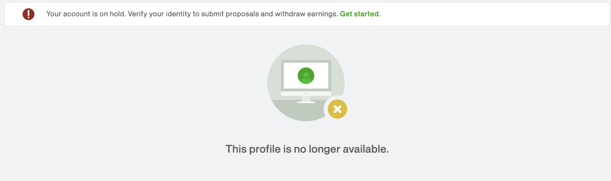

# README

**Name:** Jones Sabino

## Tools and External packages

**Virtualization:** Docker
**Programming language version:** Python 3.8.10
**Automation Library:** PlayWright
**Static Type Checker:** Pyright
**Linter:** Pylama
**Package Manager:** Poetry
**Data Validation:** Pydantic
**Retrying Library:** Tenacity

## Notes written during the exercise

- First time with ***Poetry***, ***Playwright*** and ***Pydantic**.*
- Noticed that the request headers sent from playwright are a bit different from the ones sent by me manually but since it is not a production bot and in my tests I never got blocked by the server, I didn't modified the headers in the code.
- In my tests I saw that there was no need to slow down the browsing speed nor randomize the time between the actions to pretend a ‘human-like’ interaction with the page.
- Noticed that my automation was detected when I used chromium, I didn't focused on the investigation but I suspect that it performs a client-side bot detection algorithm that looks for some script playwright runs in the browser.
- I chose to use ***Tenacity*** to manage the retries in case of exception. It is lightweight and has cool features out of the box. With more time it could be used in a more robust way.
- For this exercise I chose to map the elements and extract the data with playwright but in a prod bot I would download the html and scrape with ***bs4*** to minimize the risks of losing data in the scan, it would also increase my options on how to work with the data.

## **Would've done if there had been more time**

- Implement proper logs, with meaningful information in the different log levels. Loguru would be a strong candidate for that;
- Implement better error handling;
- Use a vault to store sensitive data. Probably I would choose Hashicorp Vault;
- Split the solution in at least 3 docker containers (code, playwright, Vault);
- Write the bot in a way that it could receive many credentials and scan all of them or the chosen ones in each execution

## **Problems Encountered**

Part of the level 2 was not possible  to achieve due to the scenario below:



As an alternative approach, I created an account but the site was unstable and I couldn't finish my profile to be able to see the required page.

## **Output**

Example of my scan output:

```json
{
    "profile": {
        "id": "7dda7dc518964655a36bab2fd8cc78c5",
        "first_name": "Bob",
        "last_name": "SuperHardworker",
        "full_name": "Bob SuperHardworker",
        "title": "Best DB administrator in the world",
        "completeness_percentage": 90,
        "pendencies": {
            "suggested_action": "Add a linked social account",
            "percentage_value": 10
        },
        "available_connects": 150,
        "visibility": "Public",
        "availability": "More than 30 hrs/week",
        "categories": [
            "Other - IT & Networking",
            "Database Administration",
            "Machine Learning"
        ],
        "recommended_jobs": [
            {
                "id": "940d245f48014e339ae688e91abae027",
                "title": "AP Physics Content Creator",
                "featured": false,
                "payment_verified": true,
                "age": "16 hours ago",
                "proposals": "Less than 5",
                "client_country": "United Kingdom",
                "project": {
                    "type": "Hourly",
                    "description": "Paid Internship - Content Creator - AP Business USA (m/f/d) YOUR ROLE As a content creator (m / f / d) Business at StudySmarter, you are responsible for creating first-class content for our website. You will become part of a young, dynamic team and support us in implementing our SEO strategy. The goal: to position StudySmarter as the # 1 EdTech startup worldwide. Your responsibilities are: If you are currently studying Business, you have the opportunity to write summaries for your degree program, learn something for your studies and earn money - win-win-win Write search engines optimized content such as explanations of concepts in school and studies. As part of our content task force, you work together on many different content projects. Work on an exciting SEO growth project in the study & school sector. Work from where you want and when you want. WHAT YOU NEED FOR THIS ROLE You have a good understanding of the requirements of different markets and cultures in the USA. You should have completed your AP (USA) and are currently studying business or have been studying and have a Bachelors or, maybe you are in your 2nd Year or higher of University. You\u2019re fluent in English (level C1). You have a background in education or tutoring. Alternatively, you have a great eye for creating learning materials that are appropriate and accessible for the target group You have a proactive and solution-oriented approach to problems Interpersonal skills and communication are among your strengths You work in a focused, structured manner and enjoy working at a fast pace in dynamic, ever-changing environments You are available for 3 or 6 months full-time or part-time Internship WHY STUDYSMARTER? You can become part of the best German Edtech startup in a highly interesting growth phase. You will have a real impact on our world by changing the way we learn. You will work independently from day one. We offer you a completely flexible working schedule. Work when you want and from where you want. We always have new, exciting projects that you can actively work on. No day will be like the other. We stand for open and regular communication - even if the job is carried out remotely. You will develop personally and professionally. We are a talented, diverse team without hierarchies. ABOUT US StudySmarter is a leading EdTech startup from Munich, which digitizes the entire learning process of students and schoolchildren with its smart learning platform. We have not only been recognized as the best learning app worldwide but have also been able to support more than a million users with learning. With our new investment behind us, we would like to gain 12 new markets for ourselves this year and significantly expand our team. Our vision: to support everyone with the latest technology in achieving their own educational goals. https://techcrunch.com/2021/05/05/studysmarter-books-15m-for-a-global-personalized-learning-push/",
                    "level": "Intermediate",
                    "est_budget": {
                        "min": 15.0,
                        "max": 18.0
                    },
                    "est_duration": "More than 6 months, 30+ hrs/week",
                    "weekly_hours": "",
                    "skills": ""
                }
            }
            {
                "id": "edd505af52544d719b5538926b506503",
                "title": "AP Psychology Content Creator",
                "featured": false,
                "payment_verified": true,
                "age": "22 hours ago",
                "proposals": "5 to 10",
                "client_country": "United Kingdom",
                "project": {
                    "type": "Hourly",
                    "description": "Content Creator - AP Psychology USA (m/f/d) YOUR ROLE As a content creator (m / f / d) Psychology at StudySmarter, you are responsible for creating first-class content for our website. You will become part of a young, dynamic team and support us in implementing our SEO strategy. The goal: to position StudySmarter as the # 1 EdTech startup worldwide. Your responsibilities are: If you are currently studying psychology, you have the opportunity to write summaries for your degree program, learn something for your studies and earn money - win-win-win Write search engines optimized content such as explanations of concepts in school and studies. As part of our content task force, you work together on many different content projects. Work on an exciting SEO growth project in the study & school sector. Work from where you want and when you want. WHAT YOU NEED FOR THIS ROLE You have a good understanding of the requirements of different markets and cultures in the USA. You should have completed your AP (USA) and are currently studying psychology or have been studying and have a Bachelors or, maybe you are in your 2nd Year or higher of University. You\u2019re fluent in English (level C1). You have a background in education or tutoring. Alternatively, you have a great eye for creating learning materials that are appropriate and accessible for the target group You have a proactive and solution-oriented approach to problems Interpersonal skills and communication are among your strengths You work in a focused, structured manner and enjoy working at a fast pace in dynamic, ever-changing environments You are available for 3 or 6 months full-time or part-time Internship WHY STUDYSMARTER? You can become part of the best German Edtech startup in a highly interesting growth phase. You will have a real impact on our world by changing the way we learn. You will work independently from day one. We offer you a completely flexible working schedule. Work when you want and from where you want. We always have new, exciting projects that you can actively work on. No day will be like the other. We stand for open and regular communication - even if the job is carried out remotely. You will develop personally and professionally. We are a talented, diverse team without hierarchies. ABOUT US StudySmarter is a leading EdTech startup from Munich, which digitizes the entire learning process of students and schoolchildren with its smart learning platform. We have not only been recognized as the best learning app worldwide but have also been able to support more than a million users with learning. With our new investment behind us, we would like to gain 12 new markets for ourselves this year and significantly expand our team. Our vision: to support everyone with the latest technology in achieving their own educational goals. https://techcrunch.com/2021/05/05/studysmarter-books-15m-for-a-global-personalized-learning-push/",
                    "level": "Intermediate",
                    "est_budget": {
                        "min": 15.0,
                        "max": 18.0
                    },
                    "est_duration": "More than 6 months, 30+ hrs/week",
                    "weekly_hours": "",
                    "skills": ""
                }
            }
        ]
    }
}
```

To run the bot, clone this repositories and run:

```bash
$ docker-compose up
```